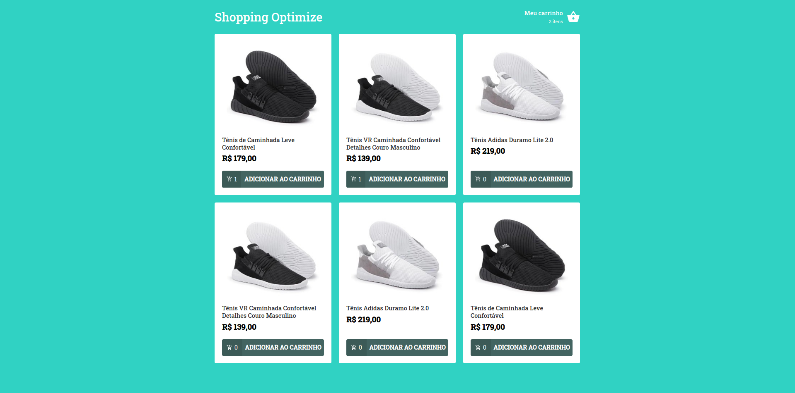
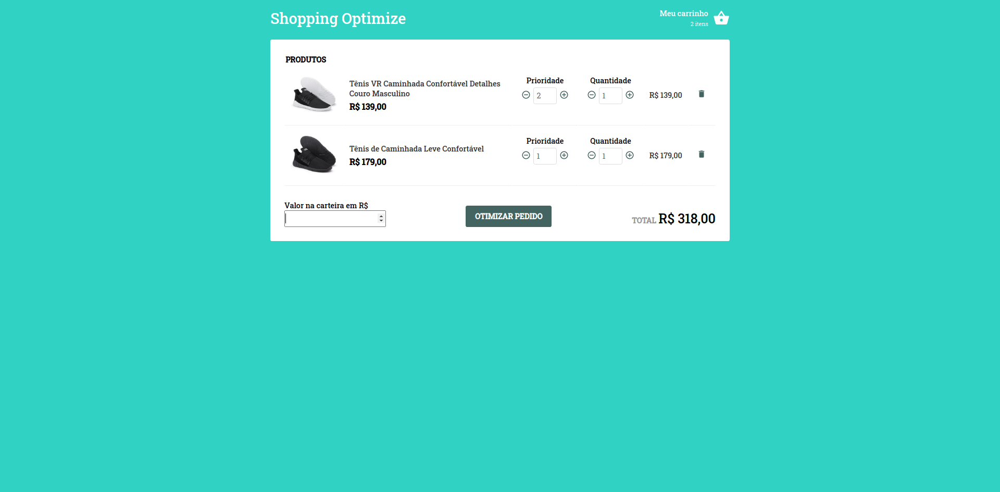
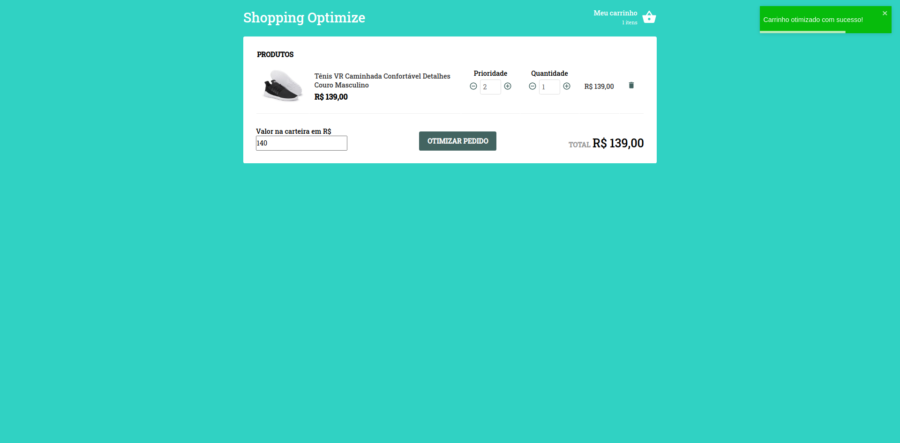

# Shopping Optimize

**Número da Lista**: 5 
**Conteúdo da Disciplina**: PD 
**Número da Dupla:** 13 

## Alunos
|Matrícula | Aluno |
| -- | -- |
| 16/0123119  |  Guilherme de Oliveira Aguiar |
| 15/0137567  |  Lucas Siqueira Rodrigues |

## Sobre
Criamos uma ferramenta responsável pela otimização do carrinho de compras de um marketplace, onde o usuário ao adicionar os produtos e quantidades no carrinho mediante da disponibilidade no estoque, pode definir a prioridade de cada produto com base no seu interesse, e informar o quanto está disposto a gastar, para que a otimização seja feita o usuário deve clicar no botão "Otimizar" para rodar o algoritmo de knapsack, que com base na prioridade e valor dos produtos irá realizar a otimização atualizando o carrinho e mantendo o maior valor dentro do maximo estabelecido pela carteira do usuário.

## Screenshots

### Home

 

### Carrinho de compras antes da otimização

 

### Carrinho de compras após a otimização

## Instalação
**Linguagem**:

- Javascript

**Tecnologias**:

- [React](https://pt-br.reactjs.org/)
- [Styled-components](https://styled-components.com/)
- [React-icons](https://react-icons.github.io/react-icons/)
- [Polished](https://polished.js.org/)
- [React-toastify](https://fkhadra.github.io/react-toastify/introduction/)

O deploy da aplicação foi feito pelo netlify na url: https://shopping-optimize.netlify.app/

Caso queira executar o projeto em sua maquina, é necessário ter o node instalado, recomendamos a utilização do yarn como gerenciador de pacotes, porém também pode ser utilizado com o npm, e siga os seguintes passos:

Clone o repositório
> git clone https://github.com/projeto-de-algoritmos/PD_ShoppingOptimize.git

Acesse a pasta
> cd PD_ShoppingOptimize

Instale as dependências
> yarn

Execute o projeto
> yarn start

## Uso
A aplicação possui duas páginas, a interação se da por meio dos botões e inputs, após adicionar produtos ao carrinho na pagina inicial, o usuário deve ir para a pagina do carrinho '/cart', definir as prioridades e se quiser alterar as quantidades dos produtos, e então definir um valor inteiro para a carteira, ao clicar no botão de otimizar o carrinho será atualizado obtendo o maximo valor possível para o valor definido na carteira com base também na prioridade dos produtos.

## Apresentação
A apresentação em video está disponível no link: https://github.com/projeto-de-algoritmos/PD_ShoppingOptimize/blob/master/Apresentacao.mp4

## Referências
- Vídeoaula do professor

